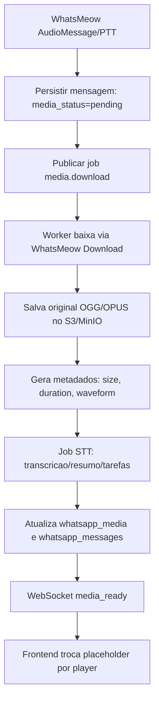
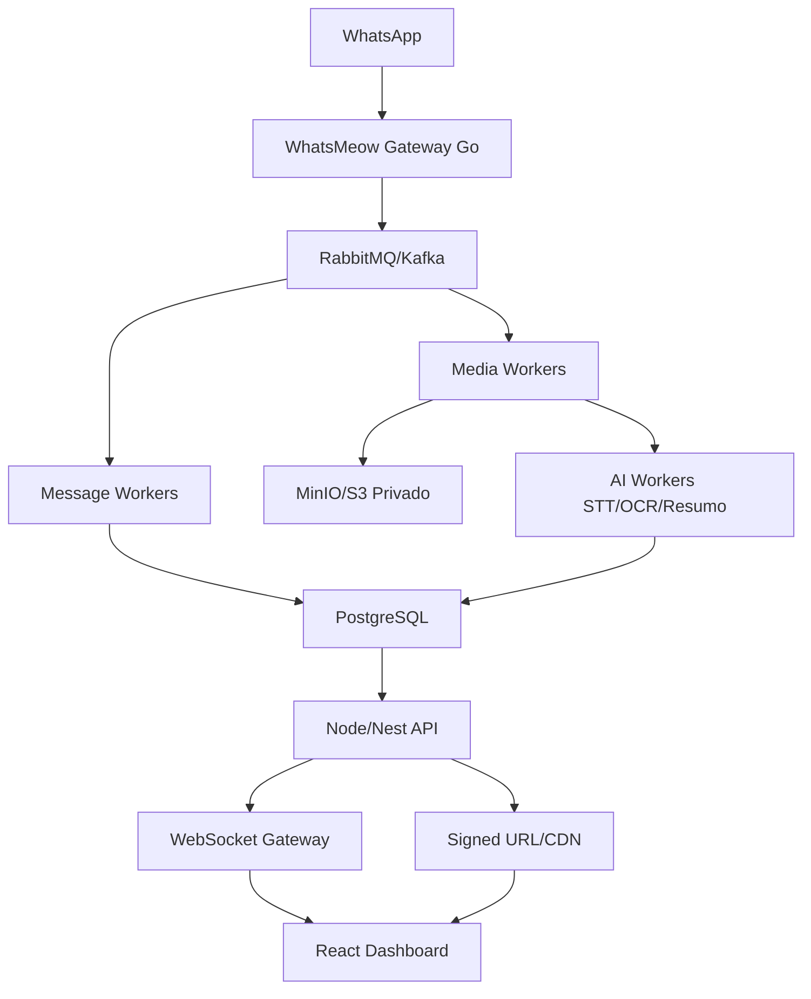

# Auditoria WhatsMeow, Midias e IA - 2026-06-03

## Sumario executivo

A plataforma ja tem uma base funcional: servico Go dedicado para WhatsMeow, API Node como gateway SaaS, PostgreSQL/Supabase como banco, MinIO/S3 ou Supabase Storage para midias, WebSocket para atualizacao em tempo real e frontend React para o painel de atendimento.

O principal gargalo esta no tratamento de midias como fluxo critico de produto. Audio, imagem, video e documento ainda sao processados de forma sincrona, sem tabela propria de midia, sem fila, sem estado de processamento, sem URL assinada integrada ao painel, sem thumbnails/waveforms e sem retry robusto. O resultado pratico aparece no painel: mensagens chegam como `type=audio`, mas podem ficar sem `media_url`, ou com URL publica inacessivel, impedindo player, leitura pela IA e transcricao.

As correcoes imediatas aplicadas nesta auditoria focam em:

- Baixar e salvar midias tambem durante importacao de historico.
- Permitir enriquecer mensagens ja existentes com `media_url`, `media_mimetype` e `media_filename`.
- Padronizar previews de midia como `Audio`, `Imagem`, `Video`, `Documento`.

Ainda e necessario complementar com uma camada de media pipeline, URL assinada/proxy autenticado, tabela `whatsapp_media`, filas e workers.

## Arquitetura atual mapeada

```text
WhatsApp Multi Device
    |
    v
WhatsMeow client - Go
    |
    v
events.Message / events.HistorySync
    |
    v
whatsapp-service
    |
    +--> PostgreSQL: whatsapp_chats / whatsapp_messages / whatsapp_contacts
    |
    +--> MinIO ou Supabase Storage: objeto de midia
    |
    +--> WebSocket Hub: new_message / history_imported
    |
    v
Node API /api/whatsapp proxy
    |
    v
React WhatsApp Dashboard
```

### Pontos de falha por etapa

| Etapa | Implementacao atual | Falhas provaveis | Melhorias |
| --- | --- | --- | --- |
| WhatsMeow | `AddEventHandler` em `client.go` | Poucos eventos tratados; sem recibos, edicoes, apagamentos, retry de midia | Event router com handlers dedicados |
| Recebimento | `handleMessage` classifica e salva | Download de midia falha e a mensagem ainda fica sem arquivo | Estado `media_status`, retry e DLQ |
| Historico | `handleHistorySync` importa mensagens | Historico antes nao baixava midias | Backfill com fila e enriquecimento incremental |
| Storage | `uploadToMinIO` ou Supabase | URL publica pode estar errada/privada; sem assinatura no painel | Media proxy autenticado ou signed URL |
| Banco | Campos de midia dentro de `whatsapp_messages` | Sem metadados ricos, duration, size, hash, waveform, thumbnail | Tabela `whatsapp_media` |
| API | Proxy Node encaminha WhatsApp API | Midia e servida por URL externa direta | Endpoint `/api/media/:id` com auth |
| Frontend | `<audio controls>` nativo | Sem waveform, retry, estado de processamento, erro claro | Player proprio estilo WhatsApp Web |
| IA | `AIAutomation` baixa `message.media_url` | Se URL falha, transcricao vira nula | Worker de transcricao conectado ao pipeline |

## Diagnostico do problema de audio

### Causas encontradas

1. **Historico importado sem midia**
   - `history_import.go` classificava audio via `extractMessageContent`, mas nao chamava `downloadAndUploadMedia`.
   - Resultado: `whatsapp_messages.type = 'audio'`, `media_url = ''`.
   - Sintoma: painel mostra placeholder `Audio` sem player.

2. **Mensagem duplicada congelava sem midia**
   - `message_repo.go` usava `ON CONFLICT DO NOTHING`.
   - Se a primeira insercao ocorreu sem midia, um processamento posterior com midia nao atualizava o registro.

3. **URL publica como contrato fragil**
   - `media.go` grava `publicURL` do MinIO/Supabase direto em `media_url`.
   - Se `MINIO_PUBLIC_URL` estiver errado, sem rota publica ou bucket privado, o navegador e a IA nao conseguem baixar.

4. **IA depende do mesmo link do painel**
   - `server/lib/AIAutomation.js` usa `fetch(message.media_url)`.
   - Se a URL do player falha, a IA tambem perde transcricao.

5. **Sem estado operacional de midia**
   - Nao ha `pending`, `processing`, `ready`, `failed`, `retry_count`, `last_error`.
   - O operador ve apenas um card pobre, sem saber se esta processando ou falhou.

### Fluxo recomendado para audio



## Auditoria WhatsMeow

### Eventos tratados hoje

No `whatsapp-service/internal/whatsapp/client.go`, o `eventHandler` trata:

- `*events.Message`
- `*events.Connected`
- `*events.Disconnected`
- `*events.LoggedOut`
- `*events.HistorySync`

### Eventos disponiveis na versao local e nao explorados

A versao local `go.mau.fi/whatsmeow v0.0.0-20260427122815-7514259253a7` expoe eventos importantes que hoje nao viram produto:

| Evento WhatsMeow | Uso sugerido | Beneficio | Complexidade |
| --- | --- | --- | --- |
| `Receipt` | Atualizar entregue/lido/reproduzido | Checks reais e SLA | Media |
| `ChatPresence` | Digitando/gravando audio | UX viva no atendimento | Baixa |
| `Presence` | Online/offline | Priorizacao de atendimento | Baixa |
| `UndecryptableMessage` | Solicitar retry e auditar falhas | Menos mensagens perdidas | Media |
| `MediaRetry` | Recuperar midia indisponivel | Corrige audio/imagem que falhou | Alta |
| `Message.IsEdit` | Mensagens editadas | Historico fiel | Media |
| `DeleteForMe`, `DeleteChat`, `ClearChat` | Exclusoes e limpeza | Compliance e consistencia | Media |
| `Picture` | Atualizar avatar | Evita 404 de fotos antigas | Baixa |
| `UserAbout`, `PushName`, `BusinessName` | Enriquecer contato | CRM mais completo | Baixa |
| `JoinedGroup`, `GroupInfo` | Metadados de grupo | Atendimento de grupos melhor | Media |
| `CallOffer`, `CallTerminate`, `CallReject` | Registrar chamadas | Timeline comercial completa | Media |
| `Blocklist`, `BlocklistChange` | Bloqueios | Governanca e suporte | Baixa |
| `PrivacySettings` | Diagnostico de conta | Suporte operacional | Baixa |
| `OfflineSyncPreview`, `OfflineSyncCompleted` | Progresso de sync | Melhor importacao | Baixa |
| `TemporaryBan`, `ConnectFailure`, `ClientOutdated` | Saude da instancia | Alertas preventivos | Media |

## Auditoria por tipo de midia

### Audio

Estado atual:

- Download via `c.waClient.Download(ctx, downloadable)`.
- Upload para MinIO/Supabase.
- Renderizacao com `<audio controls>`.
- IA tenta baixar o mesmo `media_url`.

Gargalos:

- Download sincrono dentro do handler de evento.
- Sem conversao OPUS/OGG para formatos alternativos.
- Sem duracao, waveform, velocidade, transcricao persistida.
- Sem retry/backoff.
- Sem media proxy autenticado.

Melhorias:

- Salvar original `audio/ogg; codecs=opus`.
- Gerar `duration_ms`, `waveform_json`, `transcription`, `summary`, `sentiment`.
- Worker com ffmpeg para MP3/WAV quando necessario.
- Player React proprio com velocidade 1x/1.5x/2x e estado de erro/retry.

### Imagens

Estado atual:

- Imagem salva no storage e renderizada por URL.
- Sem thumbnail local, galeria, zoom modal ou CDN formal.

Melhorias:

- Gerar thumbnail WebP.
- Salvar largura/altura/hash.
- Implementar galeria estilo Telegram.
- CDN na frente do bucket.

### Documentos

Estado atual:

- Link simples para abrir/baixar.
- Sem OCR, preview inline ou indexacao.

Melhorias:

- Preview PDF inline.
- OCR para PDF/imagens.
- Classificacao IA: contrato, matricula, comprovante, proposta.
- Busca full-text por conteudo extraido.

### Videos

Estado atual:

- Video com `<video controls>` direto.
- Sem thumbnail, compressao ou streaming adaptativo.

Melhorias:

- Gerar poster frame.
- Converter para MP4 padronizado quando necessario.
- HLS para videos maiores.
- Transcricao/resumo por IA.

## Banco de dados

### Modelo atual

`whatsapp_messages` concentra mensagem e midia:

- `type`
- `content`
- `media_url`
- `media_mimetype`
- `media_filename`

Isso e suficiente para MVP, mas limita escalabilidade e observabilidade.

### Modelo recomendado

```sql
CREATE TABLE whatsapp_media (
  id UUID PRIMARY KEY DEFAULT gen_random_uuid(),
  message_id UUID NOT NULL REFERENCES whatsapp_messages(id) ON DELETE CASCADE,
  instance_id UUID NOT NULL,
  tenant_id UUID NOT NULL,
  type TEXT NOT NULL,
  provider TEXT NOT NULL DEFAULT 'minio',
  bucket TEXT NOT NULL,
  object_key TEXT NOT NULL,
  public_url TEXT,
  mime_type TEXT,
  filename TEXT,
  size_bytes BIGINT,
  duration_ms INTEGER,
  width INTEGER,
  height INTEGER,
  sha256 TEXT,
  thumbnail_key TEXT,
  waveform JSONB,
  transcription TEXT,
  summary TEXT,
  sentiment TEXT,
  status TEXT NOT NULL DEFAULT 'pending',
  retry_count INTEGER NOT NULL DEFAULT 0,
  last_error TEXT,
  created_at TIMESTAMPTZ NOT NULL DEFAULT now(),
  updated_at TIMESTAMPTZ NOT NULL DEFAULT now()
);

CREATE INDEX idx_whatsapp_media_message ON whatsapp_media(message_id);
CREATE INDEX idx_whatsapp_media_instance_status ON whatsapp_media(instance_id, status);
CREATE INDEX idx_whatsapp_media_tenant_type ON whatsapp_media(tenant_id, type);
```

### Message status recomendado

```sql
CREATE TABLE whatsapp_message_status (
  id UUID PRIMARY KEY DEFAULT gen_random_uuid(),
  message_id UUID NOT NULL REFERENCES whatsapp_messages(id) ON DELETE CASCADE,
  status TEXT NOT NULL,
  participant_jid TEXT,
  occurred_at TIMESTAMPTZ NOT NULL DEFAULT now()
);
```

## Frontend

### Problemas atuais

- Player nativo nao comunica bem erro, carregamento, retry ou expiracao.
- Placeholder de audio nao diferencia "sem midia", "processando" e "falha".
- Sem waveform e velocidade.
- Imagens e avatares dependem de URLs externas; 404 aparece no console.
- `MessageBubble.tsx` abre midias direto por `media_url`, sem camada autenticada.

### Recomendada evolucao de UX

- Componente `AudioMessagePlayer`.
- Estados: `processing`, `ready`, `failed`, `expired`.
- Botao retry quando `media_status=failed`.
- Waveform clicavel.
- Velocidade 1x, 1.5x, 2x.
- Transcricao recolhivel abaixo do audio.
- Galeria global para midias da conversa.

Exemplo React:

```tsx
function AudioMessagePlayer({ media }) {
  if (media.status === 'processing') return <AudioSkeleton label="Processando audio" />;
  if (media.status === 'failed') return <AudioRetry mediaId={media.id} />;

  return (
    <div className="wa-audio-modern">
      <button aria-label="Reproduzir">Play</button>
      <Waveform data={media.waveform || []} />
      <select aria-label="Velocidade">
        <option>1x</option>
        <option>1.5x</option>
        <option>2x</option>
      </select>
      {media.transcription && <details><summary>Transcricao</summary>{media.transcription}</details>}
    </div>
  );
}
```

## Storage e seguranca

### Risco atual

O sistema mistura duas estrategias:

- URL publica direta (`media_url`).
- Endpoint de signed URL em Node (`/api/storage/signed-url`) ainda nao integrado ao WhatsApp Dashboard.

Isso cria risco de:

- 404 quando `MINIO_PUBLIC_URL` esta errado.
- 403 quando bucket e privado.
- Vazamento quando bucket e publico sem controle.
- Links quebrados em transcricao pela IA.

### Arquitetura recomendada

```text
Frontend
  |
  v
/api/whatsapp/media/:mediaId
  |
  +--> Auth tenant
  +--> Resolve object_key
  +--> Signed URL curto ou stream proxy
  |
  v
MinIO/S3 privado
```

Recomendacao: manter bucket privado e servir midias por URL assinada curta ou streaming proxy autenticado. O banco deve guardar `bucket` e `object_key`, nao depender apenas de URL publica.

## Escalabilidade

### Limites atuais

O servico atual faz bastante coisa no mesmo processo:

- Mantem conexao WhatsMeow.
- Recebe evento.
- Baixa midia.
- Faz upload.
- Salva banco.
- Emite WebSocket.
- Dispara automacao IA.

Esse desenho funciona para poucas instancias, mas fica fragil com muitos clientes, grupos ativos e midias grandes.

### Arquitetura alvo



Componentes sugeridos:

- RabbitMQ inicialmente; Kafka se houver volume muito alto e necessidade forte de replay.
- Redis para cache de presenca, locks, rate limit e sessoes de WebSocket.
- Workers separados por `media.download`, `media.transform`, `ai.transcribe`, `ai.ocr`.
- DLQ para falhas de midia.
- Observabilidade com logs estruturados, traces e metricas por instancia.

## IA aplicada ao atendimento

### Audio

- Transcricao automatica.
- Resumo curto.
- Extracao de tarefas.
- Extracao de datas/compromissos.
- Sentimento.
- Deteccao de urgencia.

### Documentos

- OCR.
- Resumo.
- Classificacao.
- Extracao de campos: nome, CPF/CNPJ, matricula, CAR, area, endereco.
- Indexacao full-text.

### Conversas

- Intencao.
- Objecoes.
- Proxima melhor acao.
- Score de lead.
- Preenchimento automatico do CRM.

### CRM

- Criacao/atualizacao de oportunidade.
- Tags automaticas.
- Follow-up automatico.
- Sugestao de resposta com contexto de imoveis.

## Melhorias imediatas - ate 7 dias

1. Deploy das correcoes ja aplicadas em `history_import.go`, `message_repo.go` e `client.go`.
2. Validar `MINIO_PUBLIC_URL` real em producao; hoje templates usam `https://media.seu-dominio.com`.
3. Confirmar se bucket `whatsapp-media` e publico ou privado. Se privado, integrar signed URL no painel.
4. Criar endpoint de diagnostico para media: mensagem, bucket, object key, status HTTP da URL.
5. Adicionar logs com `message_id`, `chat_jid`, `mime`, `size`, `bucket`, `storage_path`.
6. Criar query de auditoria:

```sql
SELECT id, message_id, type, media_url, media_mimetype, timestamp
FROM whatsapp_messages
WHERE type IN ('audio', 'image', 'video', 'document')
  AND COALESCE(media_url, '') = ''
ORDER BY timestamp DESC;
```

7. Reimportar conversas afetadas ou rodar backfill onde o WhatsMeow ainda conseguir recuperar a midia.

## Melhorias de curto prazo - ate 30 dias

1. Criar `whatsapp_media`.
2. Criar worker de midia com retry.
3. Trocar `media_url` publica por `object_key + signed URL`.
4. Implementar `Receipt`, `ChatPresence`, `Picture`, `UndecryptableMessage` e `MediaRetry`.
5. Criar player de audio moderno.
6. Persistir transcricao/resumo de audio.
7. Gerar thumbnails de imagem/video.
8. Criar painel de saude por instancia: conectado, ultimo evento, falhas de midia, reconnects.

## Melhorias de medio prazo - ate 90 dias

1. Gateway WhatsMeow stateless por shard de instancia.
2. RabbitMQ/Kafka para eventos.
3. WebSocket Gateway separado.
4. Redis para presenca, typing e rate limit.
5. OCR/document intelligence.
6. HLS para video.
7. Busca full-text em mensagens e documentos.
8. Analytics de atendimento e IA.
9. Politicas de retencao de midia.
10. Observabilidade completa com tracing.

## Roadmap priorizado

| Prioridade | Item | Impacto | Complexidade | Retorno |
| --- | --- | --- | --- | --- |
| P0 | Corrigir importacao/backfill de midia | Alto | Baixa | Alto |
| P0 | Validar MinIO public/signed URL | Alto | Baixa | Alto |
| P1 | Tabela `whatsapp_media` | Alto | Media | Alto |
| P1 | Worker de midia com retry | Alto | Media | Alto |
| P1 | Player de audio moderno | Alto | Media | Alto |
| P1 | Transcricao persistida | Alto | Media | Alto |
| P2 | Receipts e presenca | Medio | Media | Medio |
| P2 | OCR e preview documentos | Alto | Alta | Alto |
| P2 | Thumbnails/galeria | Medio | Media | Medio |
| P3 | HLS video | Medio | Alta | Medio |
| P3 | Kafka/event sourcing | Alto | Alta | Alto em escala |

## Exemplos de implementacao

### Go - handler de recibos

```go
case *events.Receipt:
    for _, messageID := range v.MessageIDs {
        if err := c.messageRepo.UpsertStatus(ctx, c.instanceID, string(messageID), string(v.Type), v.Timestamp); err != nil {
            c.logger.Warn("failed to persist receipt", zap.Error(err))
        }
    }
    c.broadcastEvent("message_receipt", v)
```

### Go - evento de midia pendente

```go
msg.MediaStatus = "pending"
_ = c.messageRepo.Create(ctx, msg)
_ = c.jobs.Publish("media.download", MediaJob{
    InstanceID: c.instanceID,
    MessageID: info.ID,
    ChatJID: chatJID,
})
```

### Node - signed URL para WhatsApp media

```js
app.get('/api/whatsapp/media/:id/url', verifyAuth, requireTenant, async (req, res) => {
  const media = await loadMediaForTenant(req.params.id, req.orgId);
  const url = createPresignedGetUrl({
    bucket: media.bucket,
    key: media.object_key,
    expiresInSeconds: 300,
  });
  res.json({ url });
});
```

### PostgreSQL - status operacional de midia

```sql
ALTER TABLE whatsapp_messages
ADD COLUMN IF NOT EXISTS media_status TEXT NOT NULL DEFAULT 'none',
ADD COLUMN IF NOT EXISTS media_error TEXT,
ADD COLUMN IF NOT EXISTS media_retry_count INTEGER NOT NULL DEFAULT 0;
```

## Conclusao

A plataforma esta bem posicionada para superar ferramentas genericas porque controla o canal, o CRM e a IA no mesmo produto. O ponto que separa MVP de plataforma premium e transformar midia em pipeline: armazenavel, observavel, reprocessavel, seguro e enriquecido por IA.

O primeiro ganho vem de resolver audio de ponta a ponta: download confiavel, storage privado com acesso autenticado, player moderno, transcricao e retry. Depois disso, imagens, documentos e videos seguem a mesma fundacao.
