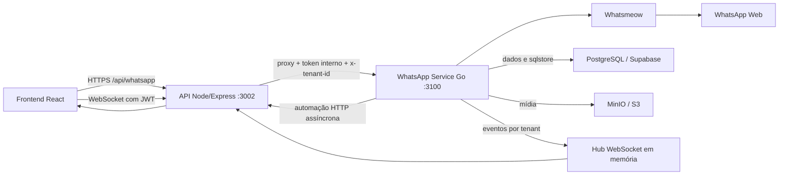
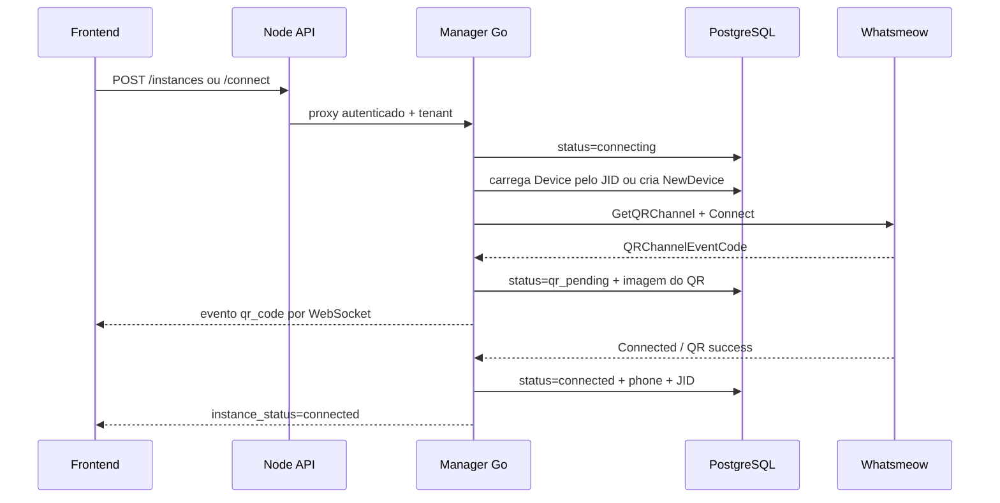
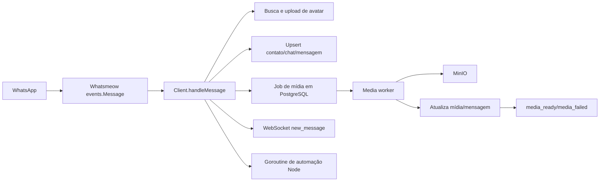
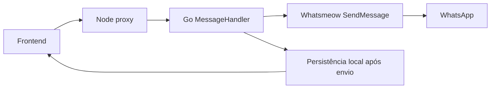
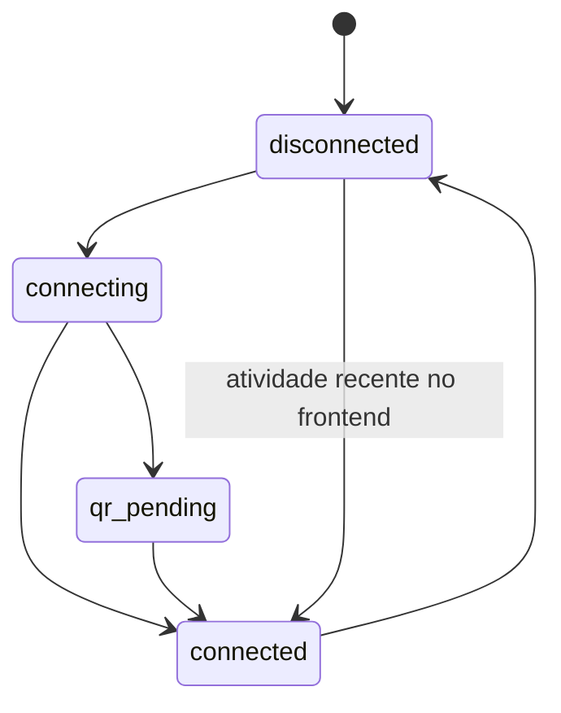
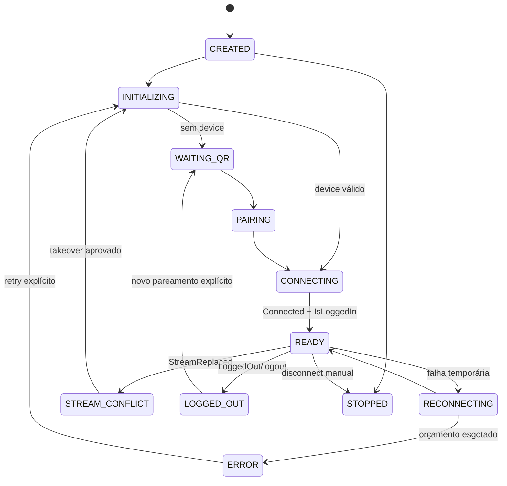
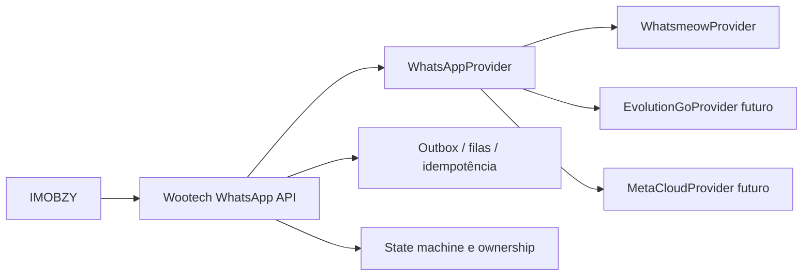

# Auditoria completa da integração WhatsApp/Whatsmeow — IMOBZY

**Data:** 2026-08-15
**Escopo:** frontend React, API Node/Express, bridge Go, Whatsmeow, PostgreSQL/Supabase, MinIO, WebSocket, Docker, filas e multi-tenancy.
**Regra desta etapa:** auditoria somente; nenhum código de produto foi alterado.

## 1. Resumo executivo

O Whatsmeow pode continuar sendo utilizado no IMOBZY, mas a implementação atual exige correções críticas no bridge, no gerenciamento de sessão, no estado de conexão, no processamento de mídia e na infraestrutura.

Não foi encontrada evidência de um bug impeditivo do Whatsmeow. Os sintomas mais perigosos são explicados pelo código do IMOBZY:

- a trava de conexão termina antes de o `Connect()` terminar e não existe lock distribuído;
- o Whatsmeow já possui auto-reconnect, mas o bridge inicia um segundo mecanismo em paralelo;
- `StreamReplaced` não é tratado;
- o endpoint chamado de logout apenas desconecta o socket e conserva as credenciais/JID;
- a sessão é associada à instância somente pelo JID gravado depois do pareamento, criando uma janela de sessão órfã em caso de crash;
- duas instâncias podem apontar para o mesmo JID sem constraint;
- API e frontend podem exibir `connected` sem autenticação ativa no WhatsApp;
- mídia de entrada e saída é carregada integralmente em RAM, sem limite;
- jobs de mídia podem permanecer eternamente em `downloading` após crash;
- segredos de produção estão rastreados em arquivos Compose;
- o stack de produção não define healthcheck nem política de restart para o bridge.

**Conclusão:** `SIM, MAS EXIGE CORREÇÕES`. A ação recomendada é **MANTER WHATSMEOW + REFATORAR O BRIDGE**, sem migrar prematuramente para outro provider.

## 2. Arquitetura atual

### Serviços identificados

| Serviço | Responsabilidade | Porta | Dependências relevantes | Persistência/health/restart |
| --- | --- | ---: | --- | --- |
| `frontend` | Dashboard, QR, inbox e WebSocket | 80 | API Node | Sem healthcheck/restart no Compose de produção |
| `api` | Auth, tenant context, proxy HTTP/WS, URLs de mídia, automação | 3002 | Supabase, bridge | Sem healthcheck/restart no Compose de produção |
| `whatsapp-service` | Clientes, sessões, eventos, envio, mídia, chamadas | 3100 | PostgreSQL, MinIO, API Node, WhatsApp | Sessões atuais no PostgreSQL; volume `.sessions` é legado; sem healthcheck/restart no Compose de produção |
| PostgreSQL/Supabase | Dados de negócio e `sqlstore` do Whatsmeow | 6543 externo | Rede/TLS | Fonte persistente das credenciais do Whatsmeow |
| MinIO/S3 | Mídias e avatares | externo/interno conforme stack | Rede/TLS | Persistente, mas configuração divergente entre stacks |
| RabbitMQ | Declarado no stack | 5672 | Nenhuma chamada encontrada no bridge WhatsApp | Não participa do fluxo atual de WhatsApp |
| Redis | Presente apenas no Compose local para Instagram | 6379 | Instagram | Não participa do fluxo atual de WhatsApp |
| Traefik | Entrada HTTPS e upgrade WebSocket | 443 | frontend/API | Roteia o WebSocket pela API Node |

## 3. Fluxo de conexão e QR

Problema central: `Manager.connectInstance()` remove a marca `connecting` ao retornar, embora o `Client.Connect()` continue numa goroutine. Uma nova chamada pode substituir e desconectar o cliente ainda em handshake. O polling de QR e cliques repetidos ampliam essa janela.

## 4. Fluxo de mensagem recebida

O handler persiste mensagens antes da mídia, o que é positivo. Porém, contato, avatar, grupo, chat e mensagem são processados sincronicamente no event handler. A própria biblioteca despacha handlers de forma síncrona; portanto, chamadas HTTP/DB lentas atrasam a ingestão.

## 5. Fluxo de envio

O envio usa o ID real retornado pelo WhatsApp e possui deduplicação por `(instance_id, message_id)`. Entretanto, se o WhatsApp aceitar a mensagem e a persistência falhar, a API apenas registra o erro e devolve sucesso. Isso cria mensagem enviada e ausente na inbox.

## 6. Gerenciamento de sessão

- Store atual: `sqlstore` PostgreSQL (`manager.go:173-183`).
- Recuperação: a instância guarda `jid`; o bridge usa esse valor para buscar o device (`manager.go:502-520`).
- Legado: SQLite em `.sessions/{instance}.db` é migrado quando encontrado (`manager.go:523-544`).
- Restart: `ReconnectAll()` reconecta toda linha com JID (`manager.go:743-763`).
- Ponto fraco: não há associação atômica `instance_id -> device`. Se o device for persistido pelo Whatsmeow e o processo cair antes de `UpdateConnected`, o JID da instância fica vazio e o próximo boot cria outro device.
- Ponto fraco: o JID não é único em `whatsapp_instances`; duas instâncias podem carregar a mesma sessão.
- Ponto fraco: `LoggedOut` só atualiza o status, e o endpoint `/logout` chama `Disconnect`, não `whatsmeow.Client.Logout()` nem `Store.Delete()`.

## 7. Problemas críticos

| ID | Problema | Categoria | Arquivo/linha | Causa raiz |
| --- | --- | --- | --- | --- |
| BUG-WA-001 | Segredos de produção rastreados no Git | E — Infraestrutura/Segurança | `docker-compose.yml:41-62,97-113`; `portainer-stack-imobfluow-filled-compose.yml:45-67,112-129` | Service role, JWT secret, DB, tokens internos, MinIO e RabbitMQ estão em texto claro |
| BUG-WA-002 | Conexões concorrentes para a mesma instância | B/C — Bridge/uso do Whatsmeow | `manager.go:211-233,292-311` | A trava termina antes da goroutine `Connect`; não há lock distribuído nem ownership por instância |
| BUG-WA-003 | Sessão pode ficar órfã após crash no pareamento | B/G — Bridge/Banco | `manager.go:502-520`; `client.go:996-1016` | Device e vínculo JID da instância não são persistidos numa associação atômica |
| BUG-WA-004 | Duas instâncias podem compartilhar o mesmo JID | B/G — Bridge/Banco | `instance_repo.go:115-121`; migrations da tabela | Ausência de `UNIQUE(jid)` parcial e de validação de ownership |
| BUG-WA-005 | Logout não encerra nem apaga a sessão | B/C — Bridge/uso do Whatsmeow | `instances.go:279-303`; `manager.go:547-570`; `client.go:550-562` | É usado `Disconnect()`, enquanto o Whatsmeow oferece `Logout(ctx)` + remoção do store |
| BUG-WA-006 | Arquivos sem limite são carregados integralmente em RAM | B — Bridge | `messages.go:208-250`; `media.go:36-75` | `io.ReadAll` e `whatsmeow.Download` sem tamanho máximo/streaming; 100 MB × concorrência pode derrubar o bridge |

### Detalhes obrigatórios dos críticos

#### BUG-WA-001

- **Severidade:** CRÍTICO
- **Função/componente:** configuração Docker/Portainer
- **Sintoma:** comprometimento total do banco, storage e canais internos se o repositório ou histórico vazar.
- **Reprodução:** `git ls-files` confirma que ambos os Compose estão rastreados; as variáveis sensíveis estão embutidas.
- **Correção:** rotacionar imediatamente todas as credenciais, substituir valores por secrets/env externos e purgar o histórico sob procedimento controlado.
- **Risco da correção:** alto risco operacional se a rotação não for coordenada com todos os serviços.

#### BUG-WA-002

- **Severidade:** CRÍTICO
- **Função:** `Manager.connectInstance()`
- **Sintoma:** QR reiniciado, cliente substituído durante handshake, `StreamReplaced`, desconexões e estado oscilante.
- **Reprodução:** enviar duas chamadas de connect separadas por poucos milissegundos após a primeira função retornar, mas antes do evento `Connected`.
- **Correção:** operação de conexão single-flight por instância, mantida até estado terminal; advisory lock/lease no PostgreSQL para múltiplas réplicas; idempotency key no endpoint.
- **Risco da correção:** médio; exige testar cancelamento, timeout e takeover após crash.

#### BUG-WA-003

- **Severidade:** CRÍTICO
- **Função:** `deviceForInstance()` / `markConnected()`
- **Sintoma:** sessão pareada existe no sqlstore, mas o IMOBZY pede novo QR após restart.
- **Reprodução:** encerrar o processo entre a persistência do device pelo Whatsmeow e `UpdateConnected()`.
- **Correção:** tabela de vínculo explícita por `instance_id`, ou metadata transacional própria; reconciliar devices órfãos no boot e no `PairSuccess`/`Connected`.
- **Risco da correção:** alto; migração deve preservar sessões reais existentes.

#### BUG-WA-004

- **Severidade:** CRÍTICO
- **Função:** pareamento/reconexão
- **Sintoma:** duas instâncias abrem as mesmas chaves e uma substitui o stream da outra.
- **Reprodução:** parear o mesmo número em duas instâncias ou duplicar o JID no banco.
- **Correção:** constraint parcial única para JID não vazio, validação pré-conexão e política de transferência explícita.
- **Risco da correção:** alto se já houver duplicatas; auditar e resolver antes da constraint.

#### BUG-WA-005

- **Severidade:** CRÍTICO
- **Função:** `LogoutInstance()`
- **Sintoma:** usuário “desconecta”, mas a sessão volta no restart; novo QR pode não surgir; credenciais antigas permanecem.
- **Reprodução:** chamar `/logout`, reiniciar o bridge e observar `ReconnectAll()` usando o JID preservado.
- **Correção:** separar `disconnect` de `logout`; logout deve chamar a API oficial, limpar store/JID/phone/QR e emitir estado `LOGGED_OUT`.
- **Risco da correção:** alto e irreversível para a sessão; requer confirmação clara na UI.

#### BUG-WA-006

- **Severidade:** CRÍTICO
- **Função:** `SendMediaMessage()` / `downloadAndUploadMediaMessage()`
- **Sintoma:** OOM, reinício do bridge e perda/atraso de mensagens.
- **Reprodução:** upload de 100 MB ou chegada concorrente de várias mídias grandes.
- **Correção:** limites por tipo/plano, `MaxBytesReader`/`LimitReader`, validação por assinatura e tamanho, quotas, streaming onde suportado e concorrência limitada.
- **Risco da correção:** médio; arquivos hoje aceitos poderão ser rejeitados de forma explícita.

## 8. Problemas altos

| ID | Problema | Categoria | Arquivo/linha | Correção recomendada |
| --- | --- | --- | --- | --- |
| BUG-WA-007 | Dois mecanismos de reconnect competem | B/C | `client.go:414-443,536-548`; default do Whatsmeow | Escolher um único owner; preferir hook/configuração do auto-reconnect do Whatsmeow com política observável |
| BUG-WA-008 | `StreamReplaced` não tratado | B/C | `client.go:522-595` | Tratar como desconexão permanente, bloquear reconnect automático e sinalizar conflito |
| BUG-WA-009 | Estado conectado falso no Go | B/C | `client.go:225-249` | Não definir `connected=true` após socket; aguardar `events.Connected` e validar `IsLoggedIn()` |
| BUG-WA-010 | Estado conectado falso no frontend | F | `constants.ts:12,46-59` | Remover promoção por atividade de 30 min; atividade deve ser indicador separado |
| BUG-WA-011 | Listagem de instâncias ignora estado vivo do bridge | A | `server/api/whatsapp/index.js:285-318` | Consultar o bridge/registry de ownership e reconciliar com o banco; não interceptar sempre como “fallback” |
| BUG-WA-012 | Job de mídia fica eternamente `downloading` após crash | B/G | `media_repo.go:175-219` | Reclaim por lease (`claimed_at < now()-timeout`) e heartbeat/worker_id |
| BUG-WA-013 | Handler do Whatsmeow faz trabalho bloqueante | B/C | `client.go:615-895,1053-1100` | Persistência mínima rápida + outbox/fila; avatar, IA, CRM e mídia fora do handler |
| BUG-WA-014 | Envio responde sucesso mesmo sem persistir | B/G | `messages.go:145-187,250-302` | Outbox/estado `accepted/sent/persist_failed`; retry transacional da persistência |
| BUG-WA-015 | CORS do bridge quebra WebSocket em domínios white-label | E/F | Compose `ALLOWED_ORIGINS`; `hub.go:121-148` | Validar origem dinamicamente no Node e substituir/assinar a identidade interna antes do bridge |
| BUG-WA-016 | Produção sem healthcheck/restart do bridge | E | `docker-compose.yml:88-120` | Liveness, readiness e `restart: unless-stopped`/policy equivalente |
| BUG-WA-017 | Healthcheck retorna 200 mesmo sem DB/WhatsApp prontos | E | `main.go:89-98,128-137` | Separar `/live` e `/ready`; readiness deve validar DB, store, dependências e capacidade do manager |
| BUG-WA-018 | Delete falha se cliente não estiver no map | B | `manager.go:574-589` | Desconexão idempotente; exclusão deve funcionar com cliente ausente |
| BUG-WA-019 | Falta recovery de clientes multi-réplica | B/E | `manager.go:743-763` | Leader/lease por instância; uma única réplica pode possuir uma sessão |

## 9. Problemas médios e baixos

| ID | Severidade | Problema | Evidência/correção |
| --- | --- | --- | --- |
| BUG-WA-020 | MÉDIO | State machine possui apenas quatro estados | `models.go:10-16` e CHECK SQL; adotar estados explícitos e transições validadas |
| BUG-WA-021 | MÉDIO | `http.DefaultClient` sem timeout no proxy legado de token WS | `main.go:251-265`; usar client dedicado com timeout |
| BUG-WA-022 | MÉDIO | ReconnectAll inicia todas as sessões sem throttling | `manager.go:743-763`; usar fila com limite de concorrência e jitter |
| BUG-WA-023 | MÉDIO | Hub WebSocket em memória e buffer global de 256 | `hub.go:47-73,93-108`; broker/outbox para escala horizontal e métricas de drop/backpressure |
| BUG-WA-024 | MÉDIO | Dockerfile usado pela CI tem Go 1.24, módulo exige 1.25 | `Dockerfile.whatsapp:1`; `go.mod:3`; alinhar e fixar patch suportado |
| BUG-WA-025 | MÉDIO | Go está fixado em 1.25.0, sem patches de segurança posteriores | `go.mod:3`; atualizar ao menos para patch suportado após testes |
| BUG-WA-026 | MELHORIA | Whatsmeow está 14 commits atrás do upstream consultado | Atual fixada: 2026-07-30; upstream consultado: 2026-08-14; avaliar changelog, especialmente fix de sqlstore/LID |
| BUG-WA-027 | BAIXO | Logs não possuem correlation ID padronizado | Adicionar `tenant_id`, `instance_id`, `event`, `message_id`, `correlation_id`, sem conteúdo/segredos |

## 10. Estado atual e estado recomendado

### Atual

A última transição é apenas visual e incorreta. `LoggedOut`, `StreamReplaced`, falha permanente e reconnect não possuem estados próprios.

### Recomendada

## 11. Banco, idempotência e transações

Pontos positivos:

- mensagens usam `UNIQUE(instance_id, message_id)` e `ON CONFLICT`;
- chats e contatos possuem constraints por instância;
- unread só incrementa quando a mensagem foi realmente inserida;
- endpoints sensíveis validam `instance/chat` por tenant;
- WebSocket é segmentado por tenant e usa JWT curto emitido pela API.

Riscos:

- o fluxo contato → chat → mensagem → WebSocket não é transacional nem usa outbox;
- falha após atualizar chat e antes de criar mensagem deixa estado parcial;
- evento WebSocket pode ser perdido após commit, pois o hub é apenas memória;
- JID da instância não é único;
- status persistido é tratado como verdade embora seja apenas último estado observado.

## 12. Segurança e multi-tenancy

### Segurança

- **Crítico:** credenciais rastreadas; devem ser consideradas comprometidas e rotacionadas.
- QR cru não é enviado ao browser; o bridge renderiza PNG data URL, ponto positivo.
- API Go exige token interno e `x-tenant-id`; API Node injeta o tenant autenticado, ponto positivo.
- Conteúdo completo de mensagem é enviado à automação Node; aplicar retenção, minimização e política LGPD.
- Logs devem evitar telefone completo, JID, conteúdo, tokens, QR e chaves de sessão.

### Multi-tenancy

- As queries dos handlers verificam ownership por tenant.
- O Hub filtra eventos por tenant.
- Não foi encontrada leitura direta de instância alheia pelos endpoints auditados.
- O risco principal é operacional: uma sessão pode ser possuída por mais de uma réplica/instância e origens white-label podem perder o WebSocket.

## 13. Filas, Redis e RabbitMQ

- Redis não participa do WhatsApp atual.
- RabbitMQ está configurado no stack, mas não é consumido pelo bridge.
- A “fila” de mídia é uma tabela PostgreSQL com `FOR UPDATE SKIP LOCKED`.
- A claim é segura contra dois workers no mesmo instante, mas não existe lease expirável para recuperar `downloading` após crash.
- Não existe outbox para mensagens/eventos nem dead-letter operacional para ingestão.

## 14. Performance e escalabilidade

| Escala | Comportamento esperado atual | Avaliação |
| ---: | --- | --- |
| 1 instância | Funciona em cenário feliz | Aceitável, mas sujeito aos bugs de estado/logout |
| 10 | Map local e pool de 20 conexões podem suportar | Requer métricas e limites de mídia |
| 100 | ReconnectAll em rajada, avatar/DB síncronos e WebSocket em memória pressionam o serviço | Alto risco |
| 500 | Uma réplica e hub em memória não oferecem ownership/HA; pool e worker serial tornam-se gargalos | Não suportado com segurança |
| 1000 | Rajada de sockets, sessão sem leases, worker de mídia serial e ausência de sharding | Não suportado |

O worker processa até 10 mídias sequencialmente. A cada mídia há timeout de até dois minutos; o throughput e o tempo de recuperação degradam rapidamente.

## 15. Cenários obrigatórios

| Cenário | Resultado atual provável | Risco |
| --- | --- | --- |
| A. Internet cai 30 s | Whatsmeow e bridge tentam reconnect em paralelo; status oscila | ALTO |
| B. Internet cai 10 min | Reconnect duplicado continua; custom para após 10, biblioteca segue; observabilidade insuficiente | ALTO |
| C. WhatsApp fecha sessão | `LoggedOut` marca disconnected, mas JID/store permanecem | CRÍTICO |
| D. Telefone offline | Multi-device pode continuar; não há estado específico nem diagnóstico | BAIXO/MÉDIO |
| E. Container reinicia | Sessões com JID voltam do PostgreSQL; sem restart policy e com janela de sessão órfã | CRÍTICO |
| F. Servidor reinicia | Igual ao E; reconexão em rajada | ALTO |
| G. Redis reinicia | Sem impacto direto no WhatsApp atual | BAIXO |
| H. PostgreSQL indisponível | Serviço continua após ping falho e `/health` pode responder 200, mas sessões/repos falham | CRÍTICO |
| I. Backend Node cai | Ingestão e DB podem continuar; automação falha em goroutine; frontend/proxy ficam indisponíveis | MÉDIO |
| J. Bridge cai | Node detecta health falho, mas stack de produção não garante restart | CRÍTICO |
| K. Duas requisições Connect | Janela permite substituir cliente ainda conectando | CRÍTICO |
| L. Usuário clica conectar cinco vezes | Mesmo risco do K; QR pode reiniciar | CRÍTICO |
| M. Cinco abas | Cinco WS/pollings; possível multiplicação de connect/QR | ALTO |
| N. 100 mensagens simultâneas | Handlers síncronos, avatares/DB e buffer WS causam backpressure | ALTO |
| O. Mídia de 100 MB | Carregada inteira em RAM na entrada/saída | CRÍTICO |

## 16. JID, LID, contatos, grupos e history sync

- O bridge tenta converter `SenderAlt`, `RecipientAlt`, JID tradicional e LID para um JID telefônico canônico.
- Mensagens individuais sem JID telefônico canônico são descartadas (`client.go:638-649`). Isso evita chats LID ilegíveis, mas pode perder mensagens quando o mapeamento LID ainda não existe.
- O upstream mais recente consultado contém uma correção de `sqlstore/lidmap` relevante ao fallback `GetManyLIDsForPNs`; a atualização deve ser avaliada em branch com teste de regressão, não aplicada cegamente.
- Grupos são aceitos e persistidos; a automação de IA é bloqueada para grupos, ponto positivo.
- History sync é limitado por configuração e usa upsert idempotente, mas ainda pode gerar carga elevada; não há fila dedicada nem orçamento global.
- Edits, deletes, reactions, mensagens indisponíveis, offline sync preview/completed, temporary ban, client outdated e stream conflict não possuem tratamento de produto completo.

## 17. Versões

- Go do módulo: `1.25.0`.
- Dockerfile de produção/CI: base `golang:1.24-alpine`, divergente do módulo.
- Dockerfile interno do serviço: `golang:1.25-alpine`.
- Whatsmeow fixado: `v0.0.0-20260730092514-662ad1dc6900`.
- Upstream detectado em 2026-08-15: `v0.0.0-20260814123134-0dcf1f50f4b1`, 14 commits à frente.
- Go 1.25.0 recebeu diversas atualizações de segurança; em 2026-08-15 o patch 1.25.12 já existia e Go 1.26.5 era a linha mais nova publicada. Atualização deve seguir testes de compatibilidade.

Fontes primárias:

- Whatsmeow `StreamReplaced` e eventos permanentes: https://github.com/tulir/whatsmeow/blob/main/types/events/events.go
- Auto-reconnect, `IsLoggedIn()` e `Logout()`: https://github.com/tulir/whatsmeow/blob/main/client.go
- Comparação da versão fixada com o upstream: https://github.com/tulir/whatsmeow/compare/662ad1dc6900...0dcf1f50f4b1
- Histórico oficial do Go: https://go.dev/doc/devel/release

## 18. Testes e verificação executada

- `vitest` WhatsApp QR/inbox: **2 arquivos, 4 testes, aprovados**.
- `go test ./...` em cópia ASCII temporária: **aprovado**.
- `go build ./cmd/server` em cópia ASCII temporária: **aprovado**.
- `go vet ./...` direto no caminho com acento: falhou por resolução de packages no ambiente Windows, limitação já documentada pelo projeto.
- `go test -race ./...` direto: não executou porque CGO não estava habilitado no host.
- Docker build/compose config: não executados porque o binário Docker não está instalado/disponível neste host.

### Gaps de teste

Não existem testes suficientes para:

- duas chamadas Connect concorrentes;
- ownership multi-réplica;
- crash entre pareamento e vínculo JID;
- `LoggedOut`, `StreamReplaced`, TemporaryBan e ClientOutdated;
- restart com sessões reais;
- reclaim de job `downloading`;
- limite de mídia e 100 mensagens simultâneas;
- WebSocket em domínio white-label;
- falha de DB após envio aceito pelo WhatsApp;
- isolamento com duas organizações reais e duas instâncias.

## 19. Possíveis bugs do Whatsmeow

Nenhum bug impeditivo foi comprovado nesta auditoria.

Há uma possível limitação operacional inerente ao uso de uma API não oficial do WhatsApp Web: mudanças de protocolo exigem atualizações frequentes e podem gerar `ClientOutdated`, mudanças de LID ou comportamento de pareamento. Isso justifica atualização controlada e interface de provider, mas não explica os bugs de concorrência, status, logout, mídia e infraestrutura encontrados no IMOBZY.

**Estimativa percentual:** evidência insuficiente para quantificar rigorosamente. Qualitativamente, a maioria dos riscos encontrados pertence à implementação/bridge e à infraestrutura do IMOBZY, não ao Whatsmeow.

## 20. Plano de correção

### Fase 0 — correções críticas

1. Rotacionar credenciais expostas e retirar segredos do Git/Compose.
2. Implementar single-flight + lease/advisory lock por instância.
3. Separar `disconnect` de `logout` e limpar sessão corretamente.
4. Criar vínculo persistente e reconciliável `instance_id -> device/JID`.
5. Impedir JID duplicado entre instâncias.
6. Limitar mídia por tamanho/tipo e controlar memória/concurrency.

### Fase 1 — estabilidade

1. Escolher um único mecanismo de reconnect.
2. Tratar `StreamReplaced`, `TemporaryBan`, `ClientOutdated`, `ConnectFailure` e `LoggedOut`.
3. Remover estados conectados inferidos; usar `Connected + IsLoggedIn()`.
4. Adicionar liveness/readiness, restart policy e reconexão com jitter/throttling.

### Fase 2 — sessões

1. Migração segura do vínculo de devices.
2. Reconciliação de devices órfãos e JIDs duplicados.
3. Ownership com lease renovável para escala horizontal.
4. Testes de restart/crash e rollback.

### Fase 3 — eventos

1. Event handler mínimo e rápido.
2. Outbox persistente e workers idempotentes.
3. WebSocket derivado da outbox, com replay/cursor.
4. Correlation IDs e métricas.

### Fase 4 — mensagens e mídia

1. Persistência resiliente após envio aceito.
2. Reclaim de mídia presa e dead-letter.
3. Limites, streaming/quota e backpressure.
4. Edits, deletes, reactions, offline sync e mensagens indisponíveis.

### Fase 5 — observabilidade

Métricas mínimas: `connections_active`, `connect_attempts`, `disconnect_total`, `stream_replaced_total`, `logged_out_total`, `reconnect_total`, `messages_received_total`, `messages_sent_total`, `message_persist_error_total`, `media_pending`, `media_stuck`, `ws_dropped`, latência e memória por instância.

### Fase 6 — arquitetura Wootech API

A interface de provider deve expor comandos e eventos normalizados, mas sessões, idempotência, state machine, outbox, multi-tenancy e mídia devem permanecer na camada Wootech, não em cada provider.

## 21. Veredito técnico do Whatsmeow no IMOBZY

1. **Existe erro impeditivo atualmente?** Sim, há riscos críticos de concorrência, sessão, logout, memória e infraestrutura; não são impeditivos intrínsecos do Whatsmeow.
2. **Existe risco de perda de sessão?** Sim, na janela entre persistência do device e vínculo JID, e no tratamento incorreto de logout/restart.
3. **Existe risco de mensagens duplicadas?** O banco deduplica por instância+message ID, mas conexões concorrentes e eventos repetidos ainda podem duplicar efeitos laterais/automação.
4. **Existe risco de mensagens perdidas?** Sim: handler bloqueante, falha de persistência após envio, descarte de LID sem mapeamento, WebSocket em memória e mídia presa.
5. **Existe risco de conflito entre instâncias?** Sim, por JID não único e ausência de ownership distribuído.
6. **Existe problema de multi-tenancy?** A autorização por tenant está razoavelmente protegida, mas há riscos operacionais de ownership e WebSocket white-label.
7. **Existe problema de concorrência?** Sim, confirmado no ciclo de conexão e no reconnect duplicado.
8. **Existe problema de reconnect?** Sim; o bridge compete com o auto-reconnect nativo e não trata eventos permanentes.
9. **Existe problema de infraestrutura?** Sim; segredos rastreados, health superficial e falta de restart/readiness no stack de produção.
10. **O Whatsmeow pode continuar sendo utilizado?** Sim, após as fases 0 e 1.
11. **Quais correções precedem qualquer migração?** Credenciais, lock/ownership, sessão/logout, verdade de estado, reconnect, limites de mídia e recovery de jobs.
12. **A arquitetura está pronta para outro provider?** Parcialmente. Existe o rótulo `provider`, mas não há contrato isolado nem camada Wootech independente; a extração deve vir depois da estabilização.

### Decisão recomendada

**CENÁRIO 5:** existe uma combinação de problemas, concentrada no bridge e na infraestrutura.
**Ações:** **MANTER WHATSMEOW**, **REFATORAR BRIDGE** e preparar a **Wootech API/provider interface** depois das correções críticas.

## 22. Correções executadas em 15/08/2026

As fases críticas e de estabilidade foram implementadas no bridge atual:

- conexão single-flight mantida até o término real da tentativa;
- ownership distribuído por lease PostgreSQL renovável;
- estado `connected` somente após autenticação (`Connected`/`IsLoggedIn`);
- auto-reconnect nativo do Whatsmeow como único mecanismo de reconexão;
- tratamento de `LoggedOut`, `StreamReplaced`, `TemporaryBan`, `ClientOutdated` e `ConnectFailure`;
- logout real separado de disconnect, com revogação/limpeza do device;
- vínculo atômico instância/JID, JID único e migration aplicada em produção;
- upload de mídia limitado a 64 MB, worker concorrente limitado e reclaim de jobs presos;
- handler de mensagens desacoplado do callback do protocolo;
- falha de persistência após envio agora retorna `202` com aviso explícito, sem fingir persistência completa;
- health/readiness com banco, restart policy e reconexão inicial espaçada;
- frontend não promove mais estado desconectado por atividade histórica;
- rota de instâncias centralizada no bridge Go;
- segredos removidos dos stacks e scripts de debug; configuração passa a exigir ambiente;
- Whatsmeow atualizado para `v0.0.0-20260814123134-0dcf1f50f4b1` e Docker alinhado ao Go 1.25.

### Evidências

- migration `20260815_whatsapp_bridge_hardening.sql` aplicada e verificada: zero JIDs duplicados, constraint ampliada, tabelas de sessão/lease e índice único presentes;
- `go test ./...` e `go build ./cmd/server`: aprovados;
- testes de regressão WhatsApp no Vitest: 4/4 aprovados;
- ESLint do frontend WhatsApp alterado: aprovado;
- build Vite de produção: aprovado;
- stacks YAML: parse válido.

O type-check geral permaneceu bloqueado por alterações simultâneas e não relacionadas nos módulos de agentes de IA e locação. A suíte Vitest completa sofreu contenção de recursos quando executada em paralelo; a única asserção reportada como falha passou isoladamente (15/15), e os testes WhatsApp passaram isoladamente (4/4).

### Operação externa ainda obrigatória

Os valores que já apareceram no histórico Git devem ser rotacionados nos provedores (Supabase, PostgreSQL, MinIO, RabbitMQ e tokens internos). Removê-los do estado atual do repositório evita nova exposição, mas não revoga credenciais já copiadas. A publicação das novas imagens/stacks também depende do pipeline de deploy; nenhum commit ou push automático foi feito.
